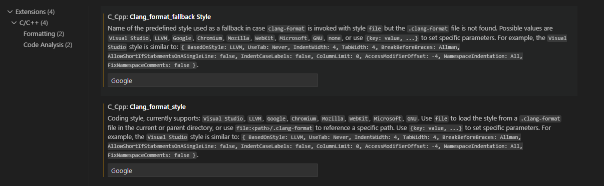

# CPP-Splitter

My uni uses a specific structure for cpp where classes have to be defined in individual files and declared in another set of files.
But I want to do it all in one file to keep track of everything.

This script will split up a cpp file to adhere to this format.

## Installation

You must have deno installed on your system (or subsystem for wsl users).

Then run:

```bash
deno install -r --allow-all -g -n split_cpp "https://raw.githubusercontent.com/Aureliona1/CPP-Splitter/main/split_cpp.ts"
```

## Usage

You can run the script from the command line with:

```bash
split_cpp "yourCPPscript.cpp" "dirName"
```

This will split `"yourCPPscript.cpp"` into separate files in the `"dirName"` directory.

**Important:** `dirName` is optional, exclude this argument to create files in the open dir.

### Formatting your CPP file

Your CPP script must be formatted as such.

```cpp
// ClassName.h
class ClassName {
	public:
	int someMethod(int);
};
// end
// ClassName.cpp

int ClassName::someMethod(int a) {
	return a * 2;
}

// end
// main.cpp

int main(){
	ClassName a;
	return 0;
}

// end
```

This script will not format your scripts, and imports will not always be correct.

It is highly recommended that you go through the files that the script creates to fix imports and such.

Additionally, files will be split most effectively when formatted to the Google cpp standard. This can be set in your VSCode settings.


## Uninstallation

If for some reason you don't want this any more, you can uninstall the script with:

```bash
deno uninstall -g split_cpp
```
